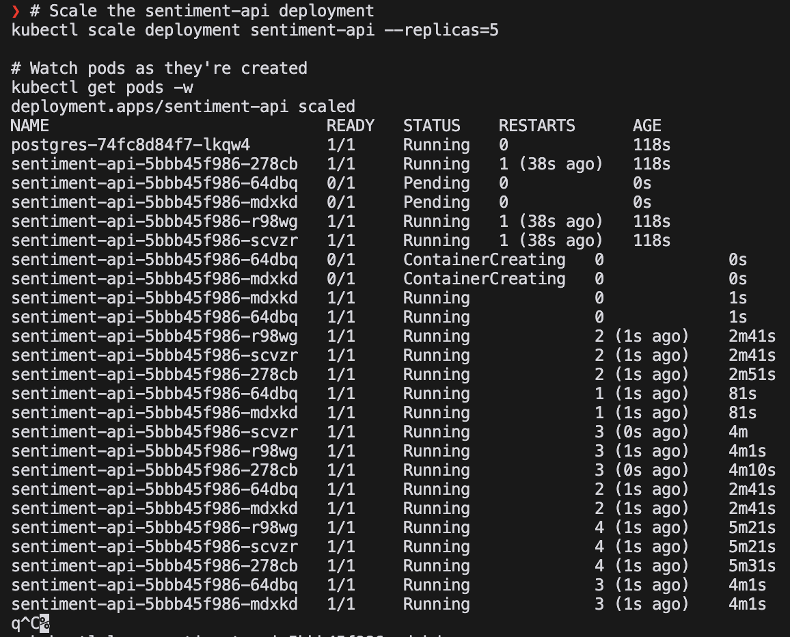

# Kubernetes

## Запустим кубернетес кластер. Выполним следующие действия:

## Сделаем билд и запустим приложение

## Применим манифесты. Напишем манифесты для postgres и app. Отправим в папку k8s. И далее применим их:

## Посмотрим на ресурсы. Выведем все ресурсы, которые есть в кластере:

## Рассмотрим отдельный под. Выведем информацию о нем:

## И наш деплой, в котором видно, что приложение запущено с тремя репликами:

## Выведем информацию о сервисе:

## Заскейлим приложение до 5 реплик:

## Посмотрим на логи отдельного пода, в том числе previous:

## Запустим Hello World на поде:

## Удалим один из подов, посмотрим, как будет перезапущен новый:

## Выведем информацию об endpoints:

## Посмотрим на состояние базы данных:

## Отправим запрос на сервис, посмотрим на результат и на базу данных:  

